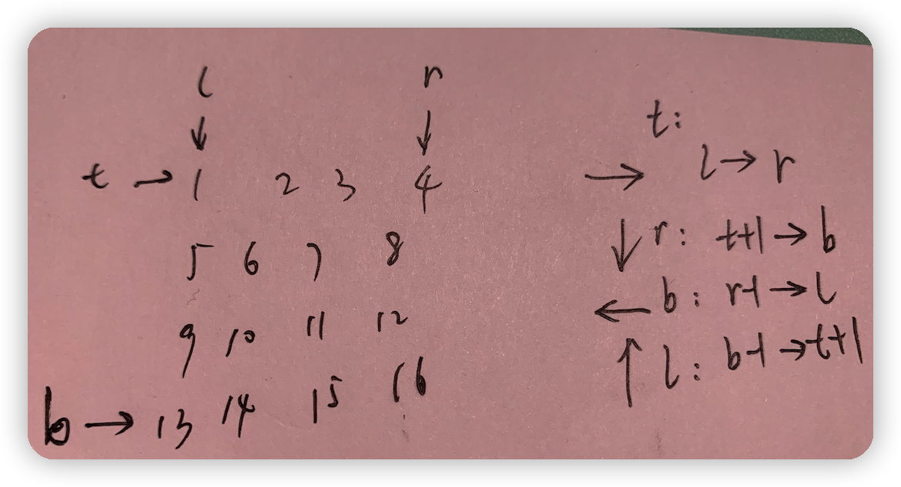

# 剑指offer(Go版本)-数组
### 1.和为S的两个数字

输入一个递增排序的数组和一个数字S，在数组中查找两个数，使得他们的和正好是S，如果有多对数字的和等于S，输出两个数的乘积最小的。

对应每个测试案例，输出两个数，小的先输出。

- 思路：双指针，i := 0 j := length - 1

```go
func findNumbersWithSum(a []int, sum int) []int {
  result := []int{}
  length := len(a)
  
  if length == 0 {
    return result
  }

  i := 0
  j := length - 1
  for i < j {
    if a[i]+a[j] == sum {
      result = append(result, i, j)
      break
    }
    if a[i]+a[j] < sum {
      i++
    }
    if a[i]+a[j] > sum {
      j--
    }
  }

  return result
}
```

### 2.和为S的连续正数序列

小明很喜欢数学,有一天他在做数学作业时,要求计算出9~16的和,他马上就写出了正确答案是100。但是他并不满足于此,他在想究竟有多少种连续的正数序列的和为100(至少包括两个数)。没多久,他就得到另一组连续正数和为100的序列:18,19,20,21,22。

现在把问题交给你,你能不能也很快的找出所有和为S的连续正数序列?

输出描述:

输出所有和为S的连续正数序列。序列内按照从小至大的顺序，序列间按照开始数字从小到大的顺序。

- 思路：双指针：cur := (low + high) * (high - low + 1) / 2 ,cur关于high的正相关，关于low的负相关。

```go
func findContinuousSequence(sum int) [][]int {
   result := [][]int{}
   low := 1
   high := 2

   for low < high {
      
      cur := (low + high) * (high - low + 1) / 2 
      if cur == sum {
         temp := []int{}
         for i := low; i <= high; i++ {
            temp = append(temp, i)
         }
         result = append(result, temp)
         low++
      }
      if cur < sum {
         high++
      }
      if cur > sum {
         low++
      }
   }
   return result
}
```

### 3.连续子数组的最大和

HZ偶尔会拿些专业问题来忽悠那些非计算机专业的同学。今天测试组开完会后,他又发话了:在古老的一维模式识别中,常常需要计算连续子向量的最大和,当向量全为正数的时候,问题很好解决。但是,如果向量中包含负数,是否应该包含某个负数,并期望旁边的正数会弥补它呢？例如:{6,-3,-2,7,-15,1,2,2},连续子向量的最大和为8(从第0个开始,到第3个为止)。给一个数组，返回它的最大连续子序列的和，你会不会被他忽悠住？(子向量的长度至少是1)

- 思路：dp/优化后的dp

```go
// 使用dp table
func maxSubArray(nums []int) int {
    length := len(nums)
    dp := make([]int, length)
    dp[0] = nums[0]
    ans := dp[0]
    for i := 1; i < length; i++ {
        if dp[i-1] > 0 {
            dp[i] = dp[i-1] + nums[i]
        } else {
            dp[i] = nums[i]
        }
        if ans < dp[i] {
            ans = dp[i]
        }
    }
    return ans
}

//dp优化，节省空间复杂度
func maxSubArray(nums []int) int {
		length := len(nums)
    sum = nums[0]
    ans := dp[0]
  for i := 1; i < length; i++ {
        if sum > 0 {         // 此时sum对应dp[i-1]
            sum += nums[i]   // 更新后sum表示dp[i]
        } else {
            sum = nums[i]    // 更新后sum表示dp[i]
        }

        if ans < sum {
            ans = sum
        }
    }
    return ans
}
```

### 4.数字在排序数组中出现的次数

统计一个数字在排序数组中出现的次数。

看到排序数组，要想到用二分查找。

先找到最前面的数字k，再找到最后面的数字k，通过下标求出次数。

- 思路：单增数组二分查找

```go
func getNumberOfK(num []int, k int) int {
  length := len(num)
  firstK := getFirstK(num, k, 0, length-1)
  lastK := getLastK(num, k, 0, length-1)
  if firstK != -1 && lastK != -1 {
    return lastK - firstK + 1
  }
  return 0
}

func getFirstK(num []int, k int, start int, end int) int {
  if start > end {
    return -1
  }
  mid := (start + end) / 2
  if num[mid] > k {
    return getFirstK(num, k, start, mid-1)
  } else if num[mid] < k {
    return getFirstK(num, k, mid+1, end)
  } else if mid-1 >= 0 && num[mid-1] == k { 
    return getFirstK(num, k, start, mid-1) 
  } else {
    return mid
  }
}

func getLastK(num []int, k int, start int, end int) int {
  length := len(num)
  mid := (start + end) / 2
  for start <= end {
    if num[mid] > k {
      end = mid - 1
    } else if num[mid] < k {
      start = mid + 1
    } else if mid+1 <= length-1 && num[mid+1] == k { 
      start = mid + 1 
    } else {
      return mid
    }
    mid = (start + end) / 2
  }
  return -1
}

```

### 5.数组中只出现一次的数字

一个整型数组里除了两个数字之外，其他的数字都出现了两次。请写程序找出这两个只出现一次的数字。

正常能想到哈希表来处理，但此题考查的是异或的知识，不同则为1，相同则为0，可以发现，0^任何数就等于数本身。

简单来说从0开始时，异或一个数相当于加上这个数，再异或这个数时，相当于减掉这个数，最后剩下的就是唯一存在的数了。

- 思路：位运算，相同两个数异或为0，0与任何数异或为本身

```go
func singleNumber(nums []int) int {
    result := 0
    for _, x := range nums {
        result ^= x 
    }
    return result
}

```

### 6.旋转数组的最小数字!

把一个数组最开始的若干个元素搬到数组的末尾，我们称之为数组的旋转。

输入一个非递减排序的数组的一个旋转，输出旋转数组的最小元素。

例如数组{3,4,5,1,2}为{1,2,3,4,5}的一个旋转，该数组的最小值为1。

NOTE：给出的所有元素都大于0，若数组大小为0，请返回0。

- 思路：二分查找

```go
func minNumberInRotateArray(rotate []int) int {
   length := len(rotate)
   if length == 0 {
      return 0
   }
   if length == 1 {
      return rotate[0]
   }
   for i := 0; i < length-1; i++ {
      
      if rotate[i] > rotate[i+1] {
         return rotate[i+1]
      } else { 
         if i == length-2 {
            return rotate[0]
         }
      }
   }
   return 0
}
```

```go
func minNumberInRotateArray(rotate []int) int {
   length := len(rotate)
   if length == 0 {
      return 0
   }
   if length == 1 {
      return rotate[0]
   }
   low := 0
   high := length - 1
   for low < high {
      mid := (low + high) / 2
      
      if rotate[mid] > rotate[high] {
         low = mid + 1
      } else if rotate[mid] < rotate[high] {
         high = mid
      } else if rotate[mid] == rotate[high] {
         high--
      }
   }
   return rotate[low]
}
```

### 7.数组中的逆序对

在数组中的两个数字，如果前面一个数字大于后面的数字，则这两个数字组成一个逆序对。输入一个数组,求出这个数组中的逆序对的总数P。并将P对1000000007取模的结果输出。即输出P%1000000007。

输入描述:

题目保证输入的数组中没有的相同的数字。

数据范围：

对于%50的数据,size<=10^4

对于%75的数据,size<=10^5

对于%100的数据,size<=2*10^5

- 示例：

输入

> 1,2,3,4,5,6,7,0

输出

> 7

- 思路：归并排序。
- mergSort 归并排序，两个作用，一是将nums的[l,r]元素进行排序，二是计算在归并排序过程中的逆序对。
- 归并排序中如何计算逆序对？归并排序过程：想要让整个数组有序，先让左半部分和右半部分数组有序，然后将这两个有序数组排序。而左半部分和右半部分分别看成一个数组递归的进行上面操作，直到数组只有一个元素。关键部分就是将两个有序数组排序。lptr，rPtr是有序数组排序过程中的待排序的两个指针。当前 lPtr 指向的数字比 rPtr 小，但是比 RR 中 [0 ... rPtr - 1] 的其他数字大，[0 ... rPtr - 1] 的其他数字本应当排在 lPtr 对应数字的左边，但是它排在了右边，所以这里就贡献了 rPtr 个逆序对。

```go
func reversePairs(nums []int) int {
    return mergeSort(nums, 0, len(nums)-1)
}


func mergeSort(nums []int, l, r int) int {
    if l >= r {
        return 0
    }
    
    mid := l + (r-l)/2
    cnt := mergeSort(nums, l, mid) + mergeSort(nums, mid+1, r)
    tmp := []int{}
    l1, r1 := l, mid+1
    for l1 <= mid && r1 <= r {
        if nums[l1] <= nums[r1] {
            cnt += r1 - (mid+1)
            tmp = append(tmp, nums[l1])
            l1++
        } else {
            tmp = append(tmp, nums[r1])
            r1++
        }
    }
    for ; l1 <= mid; l1++ {
        cnt += r+1 - (mid+1)
        tmp = append(tmp, nums[l1])
    }
    for ; r1 <= r; r1++ {
        tmp = append(tmp, nums[r1])
    }
    for i := l; i <= r; i++ {
        nums[i] = tmp[i-l]
    }
    return cnt
}
```

### 8.最小的K个数

输入n个整数，找出其中最小的K个数。例如输入4,5,1,6,2,7,3,8这8个数字，则最小的4个数字是1,2,3,4,。

- 思路：方法一：排序，然后取前k个数，O(nlogn)，O(1)。方法二：堆排序，O(nlogk),O(k)。方法三：快排分治思想，O(n),O(1)

```go
func getLeastNumbers(input []int, k int) []int {
   if len(input) == 0 || k <= 0 {
      return nil
   }
   if k >= len(input) {
      return input
   }
   sort.Ints(input)
   return input[0 : k-1]
}

// getLeastNumbers 用heap实现大根堆，然后用大根堆实现最小的k个数
func getLeastNumbers(arr []int, k int) []int {
	if k == 0 || len(arr) == 0 {
		return []int{}
	}
	d := &IntHeap{}
	heap.Init(d)
	for _, v := range arr {
		if d.Len() < k {
			heap.Push(d, v)
		} else {
			if (*d)[0] > v {
				heap.Pop(d)
				heap.Push(d, v)
			}
		}
	}
	return *d
}

// IntHeap 堆demo,利用heap实现大、小根堆，需要实现5个方法，Len,Less,Swap, Push,Pop。前三个是排序接口，后面两个是heap接口补充的
type IntHeap []int

func (h *IntHeap) Len() int {
	return len(*h)
}

// Less 定义比较规则。大根堆，Less在大于时返回小于
func (h *IntHeap) Less(i, j int) bool {
	return (*h)[i] > (*h)[j]
}

func (h *IntHeap) Swap(i, j int) {
	(*h)[i], (*h)[j] = (*h)[j], (*h)[i]
}

func (h *IntHeap) Push(x interface{}) {
	*h = append(*h, x.(int))
}

func (h *IntHeap) Pop() interface{} {
	old := *h
	n := len(old)
	x := old[n-1]
	*h = old[:n-1]
	return x
}

func getLeastNumbers(arr []int, k int) []int {
    if len(arr) == 0 || k <= 0 {
        return []int{}
    }
    return quickSearch(arr, 0, len(arr)-1, k)

}

// quickSearch 对arr中[i,j]元素进行pivot=arr[i]的划分函数处理，并将函数返回下标t与k-1比较，如果相等即返回arr[:k]，若下标小于k-1，则对[t+1,j] quickSearch递归处理，若下标大于k-1，则对[i,t-1]quickSearch递归处理。
func quickSearch(arr []int, i, j, k int) []int {
    t := partition(arr, i, j)
    if t == k-1 {
        return arr[:k]
    }
    if t < k-1 {
        return quickSearch(arr, t+1, j, k)
    }
    return quickSearch(arr, i, t-1, k)
}


// partition 划分函数，将nums的[i,j]位置元素进行划分，pivot为第一个元素nums[i]，结果是对nums原地修改，大于pivot的元素都在pivot右边，比pivot小的元素都在pivot左边。并返回pivot下标。
func partition(nums []int,i,j int) int {
    l,m,r:=i,i,j
    for l<r {
        for l<r && nums[r]>=nums[m] {
            r--
        }
        for l<r && nums[l]<=nums[m] {
            l++
        }
        if l<r {
            nums[l],nums[r]=nums[r],nums[l]
        }
    }
    nums[m],nums[l]=nums[l],nums[m]
    
    return l
}
```

### 9.数组中出现次数超过一半的数字

数组中有一个数字出现的次数超过数组长度的一半，请找出这个数字。

你可以假设数组是非空的，并且给定的数组总是存在多数元素。

示例 1:

输入: [1, 2, 3, 2, 2, 2, 5, 4, 2]
输出: 2

限制：

1 <= 数组长度 <= 50000

- 思路：方法一：哈希 O(n), O(n)；方法二：Boyer-Moore投票算法，

- 投票算法：维护一个候选众数 candidate 和它出现的次数 count。初始时 candidate 可以为任意值，count 为 0；遍历数组 nums 中的所有元素，对于每个元素 x，在判断 x 之前，如果 count=0，先将 x 的值赋予candidate，随后我们判断 x：

    - 如果 x 与 candidate 相等，那么计数器 count 的值增加 1；

    - 如果 x 与 candidate 不等，那么计数器 count 的值减少 1。

    在遍历完成后，candidate 即为整个数组的众数。

- O(n), O(1)

```go
func majorityElement(nums []int) int {
    mp := make(map[int]int)
    for _, item := range nums {
        mp[item]++
        if mp[item] > len(nums)/2 {
            return item
        }
    }
    return 0
}

func majorityElement(nums []int) int {
  candidate, count := 0, 0
  for _, num := range nums {
    if count == 0 {
      candidate = num
      count++
      break
    }
    if cadidate == num {
      count++
    } else {
      count--
    }
  }
  return cadidate
}
```

### 10.把数组排成最小的数

输入一个正整数数组，把数组里所有数字拼接起来排成一个数，打印能拼接出的所有数字中最小的一个。例如输入数组{3，32，321}，则打印出这三个数字能排成的最小数字为321323。

- 思路：排序算法，修改排序规则,O(nlogn)，O(n)
- 设数组 numsnums 中任意两数字的字符串为 xx 和 yy ，则规定 排序判断规则 为：
    - 若拼接字符串 x + y > y + xx+y>y+x ，则 xx “大于” yy ；
        反之，若 x + y < y + xx+y<y+x ，则 xx “小于” yy ；
    - xx “小于” yy 代表：排序完成后，数组中 xx 应在 yy 左边；“大于” 则反之。

```go
func minNumber(nums []int) string {
    sort.Slice(nums, func(i, j int) bool {
        m := strconv.Itoa(nums[i]) + strconv.Itoa(nums[j])
        n := strconv.Itoa(nums[j]) + strconv.Itoa(nums[i])
        return m < n
    })
    ans := ""
    for _, item := range nums {
        ans += strconv.Itoa(item)
    }
    return ans
}
```

### 11.数组中重复的数字

在一个长度为n的数组里的所有数字都在0到n-1的范围内。数组中某些数字是重复的，但不知道有几个数字是重复的。也不知道每个数字重复几次。请找出数组中任意一个重复的数字。例如，如果输入长度为7的数组{2,3,1,0,2,5,3}，那么对应的输出是第一个重复的数字2。

- 思路：可以用hash来实现，遍历的时候，元素作为key存入map，当出现重复元素时，判断key已存在，输出元素即可。O(n)，O(n)

- 数组中数字范围在0 ~ n-1 之间，可用现有数组设置标志，当一个数字被访问过后，设置对应位上的数 +n，之后再遇到相同的数时，会发现对应位上的数已经大于等于n了，直接返回这个数即可，这样不需要额外的数组或者map来处理，但是需要修改原数组。O(n)，O(1)

```go
// 哈希表
func findRepeatNumber(nums []int) int {
    mp := make(map[int]int)
    for _, item := range nums {
        mp[item]++
        if mp[item] > 1 {
            return item
        }
    }
    return -1
}

// 原地修改数组
func findRepeatNumber(nums []int) int {
    length := len(nums)
    for _, x := range nums {
        if x >= length {
            x -= length
        }
        if nums[x] >= length {
            return x
        }
        nums[x] += length
    }
    return -1
}

```

### 12.滑动窗口的最大值

给定一个数组和滑动窗口的大小，找出所有滑动窗口里数值的最大值。

给定一个数组 nums 和滑动窗口的大小 k，请找出所有滑动窗口里的最大值。

示例:

输入: nums = [1,3,-1,-3,5,3,6,7], 和 k = 3
输出: [3,3,5,5,6,7]
解释:

滑动窗口的位置                最大值

---

[1  3  -1] -3  5  3  6  7       3
1 [3  -1  -3] 5  3  6  7       3
1  3 [-1  -3  5] 3  6  7       5
1  3  -1 [-3  5  3] 6  7       5
1  3  -1  -3 [5  3  6] 7       6
1  3  -1  -3  5 [3  6  7]      7

提示：

你可以假设 k 总是有效的，在输入数组不为空的情况下，1 ≤ k ≤ 输入数组的大小。

- 思路：
    - 方法一：暴力求解，共有n-k+1个框，每个框求最大值, 时间复杂度O((n-k+1)k)=O(nk)。
    - 方法二：

```go
func maxInWindows(nums []int, k int) []int {
   length := len(nums)
   if length == 0 || k <= 0 || length < k {
      return nil
   }
   var result []int
   
   for i := 0; i <= length-k; i++ {
      if k == 1 {
         return nums
      }
      
      temp := nums[i]
      for j := i+1; j < i+k; j++ {
         if nums[j] > temp {
            temp = nums[j]
         }
      }
      result = append(result, temp)
   }
   return result
}

```

### 13.构建乘积数组

[构建乘积数组](https://leetcode.cn/problems/gou-jian-cheng-ji-shu-zu-lcof/)

给定一个数组 A[0,1,…,n-1]，请构建一个数组 B[0,1,…,n-1]，其中 B[i] 的值是数组 A 中除了下标 i 以外的元素的积, 即 B[i]=A[0]×A[1]×…×A[i-1]×A[i+1]×…×A[n-1]。不能使用除法。

示例:

输入: [1,2,3,4,5]
输出: [120,60,40,30,24]

提示：

所有元素乘积之和不会溢出 32 位整数
a.length <= 100000

- 思路：方法一：先将数组中所有元素相乘，然后遍历到那个元素直接除以该元素即可，但是如果数组中有0则失效。
    - 方法二：构建左右乘积列表，遍历两次数组，得到左右两个乘积列表L[i],R[i]。其中L[i] = L[i-1]*a[i]。i在[1,n-1],R[i]=R[i+1]*a[i] i在[n-2,0],从后往前。O(n),O(n)
    - 方法三：在方法二的基础上，把结果数组和L[i]共有，并且没有R[i]，R在动态创建。具体就是先初试话res[i]为L[i]，然后R = R * a[i], res[i] = res[i]*R, R更新res[i]也在更新。 O(n)，O(1)

```go
func constructArr(a []int) []int {
    if len(a) == 0 {
        return []int{}
    }
    aLen := len(a)
    L, R, res := make([]int, aLen), make([]int, aLen), make([]int, aLen)
    L[0], R[aLen-1] = 1, 1
    for i := 1; i < aLen; i++{
        L[i] = L[i-1] * a[i-1]
        R[aLen-1-i] = R[aLen-i] * a[aLen-i]
    }
    for i := 0; i < aLen; i++ {
        res[i] = L[i] * R[i]
    }
    return res
}

func constructArr(a []int) []int {
    if len(a) == 0 {
        return []int{}
    }
    aLen := len(a)
    res := make([]int, aLen)
    res[0] = 1
    for i := 1; i < aLen; i++{
        res[i] = res[i-1] * a[i-1]
    }
    R := 1
    for i := aLen-2; i >= 0; i-- {
        R = R * a[i+1]
        res[i] = res[i] * R
    }
    return res
}
```

### 14.二维数组中的查找

在一个二维数组中（每个一维数组的长度相同），每一行都按照从左到右递增的顺序排序，每一列都按照从上到下递增的顺序排序。请完成一个函数，输入这样的一个二维数组和一个整数，判断数组中是否含有该整数。

- 思路：数组遍历，从右上角元素开始，大于目标元素则左移，小于目标元素则下移，直到找到或便利一遍为止.O(n)，O(1)

```go
func searchMatrix(matrix [][]int, target int) bool {
    if matrix == nil || len(matrix[0]) < 1  {
        return false
    }
    
    row := 0
    col := len(matrix[0]) - 1
    
    //从右上角元素开始，大于目标元素则左移，小于目标元素则下移，直到找到或便利一遍为止
    for row <= len(matrix) - 1 && col >= 0 {
        if matrix[row][col] > target {
            col --
        } else if  matrix[row][col] < target {
            row ++
        } else {
            return true
        }
    }
    
    return false
}

```

### 15.顺时针打印矩阵

输入一个矩阵，按照从外向里以顺时针的顺序依次打印出每一个数字。

示例 1：

输入：matrix = [[1,2,3],[4,5,6],[7,8,9]]
输出：[1,2,3,6,9,8,7,4,5]
示例 2：

输入：matrix = [[1,2,3,4],[5,6,7,8],[9,10,11,12]]
输出：[1,2,3,4,8,12,11,10,9,5,6,7]

- 思路：从左到右，从上到下，从右到左，从下到上依次遍历数组，用l,r,t,b四个指针用于限定遍历区间，遍历过程是循环的，每循环依次更新一次四个指针。O(mn)，O(1)



```go
func spiralOrder(matrix [][]int) []int {
    if len(matrix) == 0 {
        return []int{}
    }
    m, n := len(matrix), len(matrix[0])
    ans := make([]int, 0)
    l, r, t, b := 0, n-1, 0, m-1
    for l <= r && t <= b {
        for i := l; i <= r; i++ {
            ans = append(ans, matrix[t][i])
        }
        for i := t+1; i <= b; i++ {
            ans = append(ans, matrix[i][r])
        }
      	if b > t {  // 注意 从右到左遍历需要b>t，否则可能与从左到右遍历的同一行
            for i := r-1; i >= l; i-- {
                ans = append(ans, matrix[b][i])
            }
        }
        if l < r {  // 注意 从下到上遍历需要l<r，否则可能与从上到下遍历的同一列
            for i := b-1; i >= t+1; i-- {
                ans = append(ans, matrix[i][l])
            }
        }
        l++
        r--
        t++
        b--
    }
    return ans
}
```

### 16.[扑克牌中的顺子](https://leetcode.cn/problems/bu-ke-pai-zhong-de-shun-zi-lcof/)

从若干副扑克牌中随机抽 5 张牌，判断是不是一个顺子，即这5张牌是不是连续的。2～10为数字本身，A为1，J为11，Q为12，K为13，而大、小王为 0 ，可以看成任意数字。A 不能视为 14。

示例 1:

输入: [1,2,3,4,5]
输出: True

示例 2:

输入: [0,0,1,2,5]
输出: True

限制：

数组长度为 5

数组的数取值为 [0, 13] .

- 思路：55 张牌是顺子的 **充分条件** 如下：
    - 除大小王外，所有牌 无重复 ；
    - 设此 55 张牌中最大的牌为 maxmax ，最小的牌为 minmin （大小王除外），则需满足：max - min < 5
- 判断重复问题用map，最大值和最小值在遍历时用ma，mi标记。
- O(1)，O(1), mp和nums只有5个数，所以O(5)=O(1)

```go
func isStraight(nums []int) bool {
    mp := make(map[int]int)
    mi,ma := 20, -1
    for _, item := range nums {
        if item == 0 {
            continue
        }
        mp[item]++
        if mp[item] > 1 {
            return false
        }
        if item > ma {
            ma = item
        }
        if item < mi {
            mi = item
        }
    }
    return ma - mi < 5
}
```

### 17.调整数组顺序使奇数位于偶数前面

输入一个整数数组，实现一个函数来调整该数组中数字的顺序，使得所有奇数在数组的前半部分，所有偶数在数组的后半部分。

示例：

输入：nums = [1,2,3,4]
输出：[1,3,2,4]
注：[3,1,2,4] 也是正确的答案之一。

提示：

0 <= nums.length <= 50000
0 <= nums[i] <= 10000

- 思路：
    - 方法一：两个数组，一个保留奇数，一个保留偶数。O(n)，O(n).
    - 方法二：不用偶数切片，只需要先计算好奇数个数count，然后偶数直接放在ans切片从count位置开始的后面即可。O(n)，O(1)
    - 方法三：前两种方法都保留了之前数字的相对位置，**如果不用保留相对位置并且可以修改原数组的话**，可以用双指针从两端遍历，左指针找偶数，右指针找奇数，然后互换就行了。O(n)，O(1)

```go
func exchange(nums []int) []int {
    odd, even := make([]int, 0), make([]int, 0)
    for _, item := range nums {
        if item & 1 == 1 {  // 奇数和1与运算为1，偶数与1与运算为0
            odd = append(odd, item)
        } else {
            even = append(even, item)
        }
    }
    odd = append(odd, even...)
    return odd
}

func exchange(nums []int) []int {
    ans := make([]int, len(nums))
    count := 0
    for _, item := range nums {
        if item & 1 == 1 {  // 奇数和1与运算为1，偶数与1与运算为0
            ans[count] = item
            count++
        }
    }
		// 这里oddCount其实是下标
    for _, item := range nums {
        if item & 1 != 1 {
            ans[count] = item
            count++
        }
    }
    
    return ans
}

func exchange(nums []int) []int {
    l, r := 0, len(nums)-1
    for l < r {
        for l < r && nums[l] & 1 == 1 {
            l++
        }
        for l < r && nums[r] & 1 == 0 {
            r--
        }
        if l < r {  // 这里也需要判断l<r，因为前面两个for循环可能从l<r中跳出来即l=r，此时不需要交换。
            nums[l], nums[r] = nums[r], nums[l]
        }
        l++
        r--
    }
    
    return nums
}
```

### 18.0～n-1中缺失的数字

一个长度为n-1的递增排序数组中的所有数字都是唯一的，并且每个数字都在范围0～n-1之内。在范围0～n-1内的n个数字中有且只有一个数字不在该数组中，请找出这个数字。

示例 1:

输入: [0,1,3]
输出: 2
示例 2:

输入: [0,1,2,3,4,5,6,7,9]
输出: 8

限制：

1 <= 数组长度 <= 10000

- 思路：缺失有三种情况：
    - 1)在0~n-1中间缺少，比如0,1,3。
    - 2)缺少最右边元素，比如0,1
    - 3)缺少最左边元素，比如1,2
    - 方法一：对于第一种和第三种，遍历一遍，对每个元素与下标对比，如果不相等就输出item-1。第二种，会通过前面的判断，此时缺少的就是最右边元素，只需输出len(nums)。O(n),O(1)
    - 方法二：二分查找，判断nums[mid] 与 mid是否相等，若相等则左边[0,mid]是从0开始连续的，mid右移，否则不连续左移。当l与r相等时还要判断一次，比如到了[7,9]时，mid=7 == nums[mid] = 7，表示[0,7]都是有序的，mid右移,此时l = r = 8,还需要循环一次，mid=8 != nums[mid]=9 此时r = mid-1, l > r退出循环，l所指位置即为所缺数字8。如果缺最右边数字，比如0,1，l会一直在第一个判断中循环，最后l=len(nums) > r退出循环体。O(logn),O(1)

```go
func missingNumber(nums []int) int {
    for i, item := range nums {
        if item != i {
            return item-1
        }
    }
    
    return len(nums)
}
func missingNumber(nums []int) int {
    l, r := 0, len(nums)-1
    for l <= r {
        mid := l + (r - l) >> 1
        if nums[mid] == mid {
            l = mid + 1
        } else {
            r = mid - 1
        }
    }
    return l
}
```

### 19.在排序数组中查找数字！

统计一个数字在排序数组中出现的次数

示例 1:

输入: nums = [5,7,7,8,8,10], target = 8
输出: 2
示例 2:

输入: nums = [5,7,7,8,8,10], target = 6
输出: 0

提示：

0 <= nums.length <= 105
-109 <= nums[i] <= 109
nums 是一个非递减数组
-109 <= target <= 109

- 思路：二分查找，找左右边界

```go
func search(nums []int, target int) int {
    if len(nums) == 0 {
        return 0
    }
    lm, rm := getLeftMin(nums, target), getRightMax(nums, target)

    if rm - lm < 0 {
        return 0
    }
    return rm -lm + 1
}

func getLeftMin(nums []int, target int) int {
    left, right := 0, len(nums)-1
    for left < right {
        mid := left + (right-left)/2
        if nums[mid] >= target {
            right = mid
        } else if nums[mid] < target {
            left = mid+1
        }
    }
    if nums[left] == target {
        return left
    }
    return len(nums)
}

func getRightMax(nums []int, target int) int {
    left, right := 0, len(nums)-1
    for left < right {
        mid := left + (right-left+1) /2
        if nums[mid] > target {
            right = mid-1
        } else if nums[mid] <= target {
            left = mid
        }
    }
    if nums[left] == target {
        return left
    }
    return -1
}
```